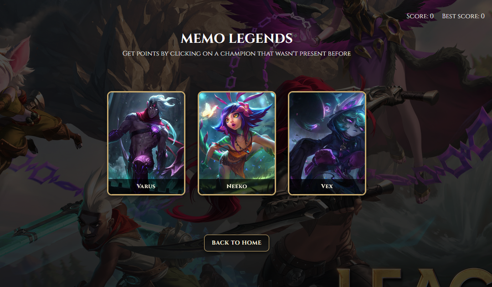

# Odin Memory Card

This project was developed as part of **[The Odin Project](https://www.theodinproject.com/)** React curriculum.  
The main objective was to build a **Memory Card Game** where players must memorize the elements in a deck and later identify which element was not included.

## 🚀 Demo

👉 [Live Demo Here](https://odin-memory-card-cyan.vercel.app/)

## 📸 Screenshot

## 🛠️ Built With

- ⚛️ [React](https://reactjs.org/)
- 🖼️ HTML5
- 🎨 CSS3

## 📂 Project Structure

- **Control Section** – Allows the player to choose a difficulty level (EASY, MEDIUM, HARD), each with a different number of champions.
- **Game Section** – The player must identify the champion that was not present in the previous round.